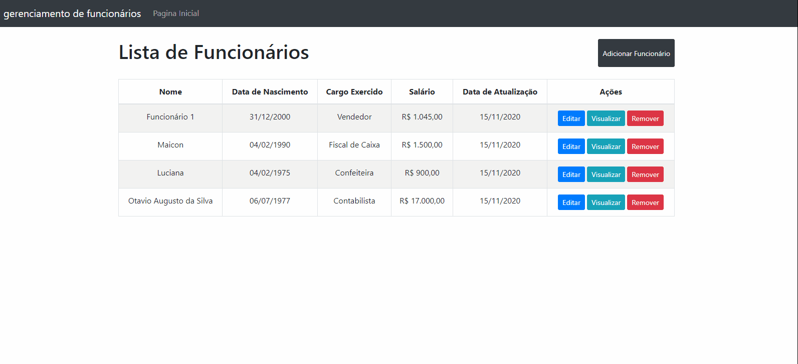

<h1 align="center">
<br>

<p align="center">
    <h1 align="center"> Gerenciamento de funcionários </h1>
    <b>Uma plataforma simples com o objetivo de auxiliar na gestão básica de lista de funcionários </b>
</p>

<div align="center" >
    
    </div>

<p align="center">
  <a href="#bookmark-about">About</a>&nbsp;&nbsp;&nbsp;|&nbsp;&nbsp;&nbsp;
  <a href="#computer-technologies">Technologies</a>&nbsp;&nbsp;&nbsp;|&nbsp;&nbsp;&nbsp;
  <a href="#package-installation">Installation</a>&nbsp;&nbsp;&nbsp;|&nbsp;&nbsp;&nbsp;
</p>

## :bookmark: About

Ésta é uma plataforma que foi desenvolvida para um teste empresarial 

<br>

## 🛠 Techs

- **Web**

  - [React](https://reactjs.org/)
  - [Typescript](https://www.typescriptlang.org/)
  - [ReactBootstrap](https://react-bootstrap.github.io/)

- **Backend**
  - [Nodejs](https://nodejs.org/en/)
  - [Express](https://expressjs.com/)
  - [Typeorm](https://typeorm.io/)

- **Banco de Dados**
  - [PostgreSQL](https://dbeaver.io/)

<br>

## :package: Installation

### :heavy_check_mark: **Pré-requisitos**

É necessária apenas os seguintes software

- **[Node.js](https://nodejs.org/en/)**
- **[Git](https://git-scm.com/)**
- **[NPM](https://www.npmjs.com/)** or **[Yarn](https://yarnpkg.com/)**

<br>

### Para rodar a plataforma  🚀

#### Cloning

```ps
# Clone o repositório utilizando o git
$ git clone https://github.com/Brenovieira41/seven-inc.git
```

### :arrow_forward: **Exutando**

- :package: API (Back-end)

```sh
  $ cd backend
  # Dependencies install.
  $ yarn # or npm install
  # Data base creation.
  $ yarn typeorm migration:run # or npm run typeorm migration:run
  # API start
  $ yarn dev # or npm run dev
```

- :computer: Site web

```sh
  $ cd web
  # Dependencies install.
  $ yarn # or npm install
  # Running web app
  $ yarn start # or npm start
```